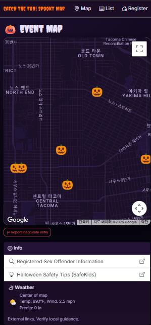

# 🎉 CatchTheFun – SpookyMap Edition 🎃

**Welcome to CatchTheFun – A community-powered platform to help you never miss what's fun around you.**  
This version, **SpookyMap**, focuses on Halloween house participation and trick-or-treat route planning.

---

## 📸 Screenshots

---

## 📌 What is CatchTheFun?

CatchTheFun is a flexible, map-based platform that allows users to discover and share local community events — from Halloween house tours to yard sales, block parties, and more. This repository demonstrates the **Halloween-themed version** of the platform called **SpookyMap**.

---

## ✨ Features in SpookyMap Edition

### 🏠 House Registration
Users can pin their house on the map to show they’re participating in Halloween.  
Details include:
- Participation hours  
- Type of candy  
- Whether adult treats ("boos") are available  
- Optional photo and description  

### 🗺️ Map View & Filters
- View all registered houses on a Google Map  
- Click pins to view house info  
- Filter by participation time or candy type (Planned)

### 🚶 Route Optimization *(Coming Soon)*
- Generate an optimized trick-or-treat walking route  
- Avoid unsafe areas based on public data  
- Choose shortest or most fun-packed path

### 🛡️ Safety Feature
- Admins can moderate submitted house data  
- Users can report inaccurate entries  
- Links to public safety sites (e.g. sex offender registry)

---

## 🧠 Reusability

Although this version is Halloween-specific, the project is structured to support other local events in the future, such as:
- 🏷️ Yard Sales  
- 🎨 Art Walks  
- 🎉 Block Parties  
- 🧼 Community Clean-up Days

All event types will use the same map-based pinning and filtering system, customized per theme.

---

## 🛠 Tech Stack

- **Framework:** ASP.NET Core MVC (.NET 6/8)
- **Frontend:** Razor Views, Bootstrap, JavaScript
- **Map Integration:** Google Maps API
- **Database:** Entity Framework Core + SQL Server
- **Hosting:** Azure Web App (Planned)

---

## 💬 Credits
Created by Uju Krallum
Final Project for CPTC – ASP.NET Core Web Development (Summer 2025)

---

## 📄 License
This project is open-source for educational and demonstration purposes.  
Commercial use is not permitted without the author's permission.

